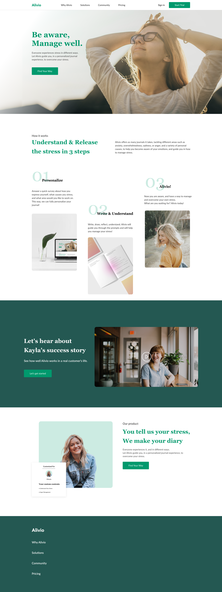

# Alivio Landing Page

A responsive landing page for a personal time management service. The project is built according to the Figma design.

## 🚀 Live Demo

Check out the live project: [GitHub Pages](https://juliathedev.github.io/Alivio/)

## 📋 Features

- Fully responsive design (320px → 1920px)
- Semantic HTML5 markup
- BEM methodology for CSS classes
- Flexbox and Grid layouts
- Custom button styles
- Video block with play button
- Mobile-first approach

## 🛠 Technologies Used

- **HTML5** — semantic structure
- **CSS3** — styling, animations, media queries
- **Flexbox / Grid** — layouts
- **Git / GitHub Pages** — version control and deployment
